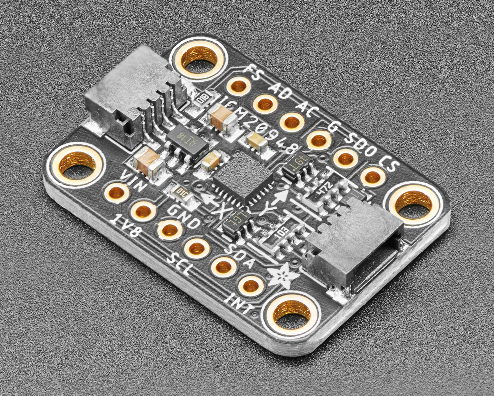
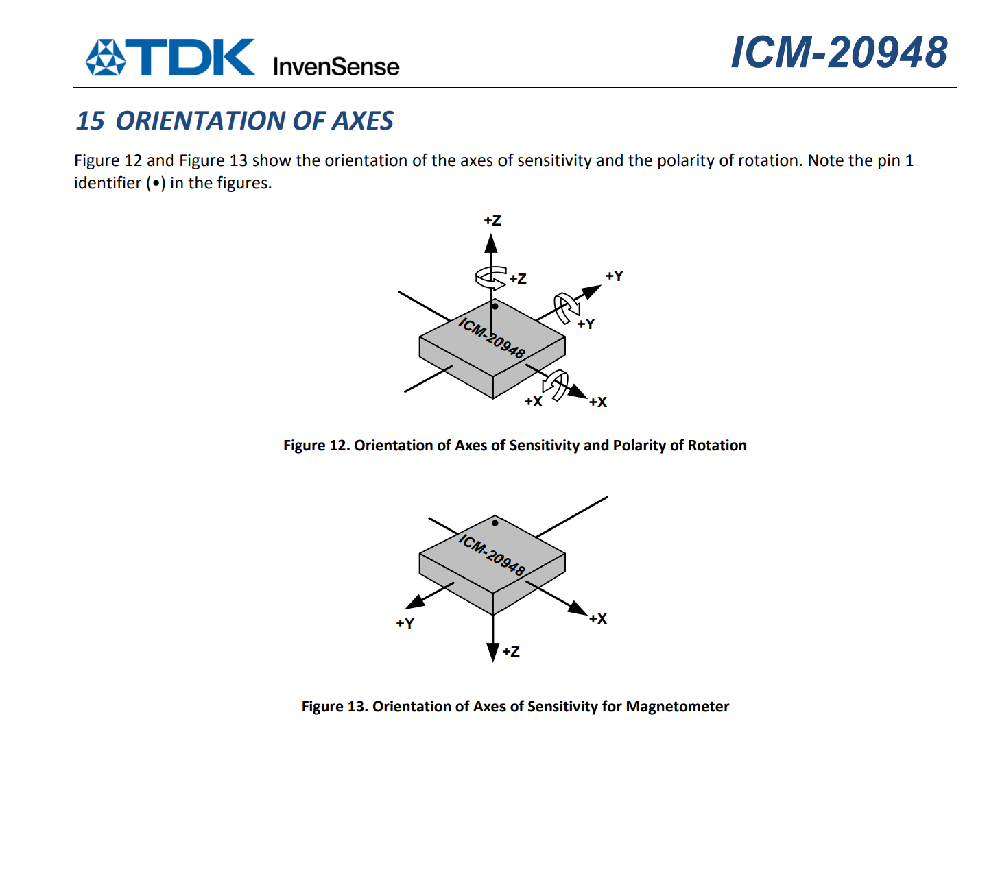

# SeedESP32-ICM20948 — 現状ドキュメント

- 最終更新: 2026/09/04（この時点のコード/設定をまとめたもの）
- 用途: **XIAO ESP32-C3 + ICM-20948（AK09916 内蔵 9 軸）を 100Hz で読み、USB シリアル（CDC）経由で CSV を送る「9 軸ストリーマー」**
- 送信先: Raspberry Pi（pypilot の中継スクリプト `boatimu.py`・本リポジトリ外）

> **用語の注意**：コードコメントに「生データ」とありますが、これは「フィルタ/加工なしで読む」という意味です。
> 実際に送信しているのは**ライブラリ内で物理量（float）へ正規化した値**（16bit 整数の LSB 値ではありません）。
> 詳細は「3-2 データ変換パイプライン」参照。

---

## 1. 現在のファイル構成

| パス | 役割 | 状態 |
| --- | --- | --- |
| `src/main.cpp` | XIAO ファームウェア本体（100Hz 9 軸 CSV ストリーマー） | 現役 |
| `platformio.ini` | PlatformIO ビルド設定（seeed_xiao_esp32c3 / arduino） | 現役 |
| `visualizer/axis_capture.py` | 軸マッピング実験用キャプチャツール（現行 CSV フォーマット対応） | 現役 |
| `visualizer/pyproject.toml` / `uv.lock` | visualizer の Python 実行環境（uv 管理） | 現役 |
| `.vscode/` | VSCode/PlatformIO の IDE 設定 | 現役 |
| `README.md` | 本ドキュメント | 現役 |
| `archive/` | 過去のドキュメント・計測データ・ログ・旧ツールの退避先 | 参照用 |

---

## 2. ハードウェア構成と結線

| ICM-20948 側 | XIAO ESP32-C3 側 | 備考 |
| --- | --- | --- |
| VIN（または 3Vo） | 3V3 | 3.3V 電源 |
| GND | GND | |
| SDA | D4（GPIO 6） | I2C |
| SCL | D5（GPIO 7） | I2C |

- I2C アドレス: `0x69`（Adafruit ICM-20948 Breakout、AD0=High）、400kHz
- Wire タイムアウト: 5ms（バスハング時の無限待ち防止）
- 配線長は 3〜5cm 以内。XIAO の IPEX コネクタへロッドアンテナを装着
- 磁気計測時は金属・PC・電源類から 50cm 以上離す

### 写真（参考）

**Adafruit ICM-20948 9DoF ブレイクアウト基板**（基板の印字 X/Y が、このドキュメントで述べる座標系（X=北, Y=東/西, Z=上下）の基準になる）



**ICM-20948 パッケージ内のダイの軸定義**（地磁気 AK09916 は別ダイのため、Y・Z 軸が加速度・ジャイロと反転して実装されている）



---

## 3. XIAO ファームウェア仕様（`src/main.cpp`）

### 3-1 センサ設定（起動時に明示設定）

| 項目 | 設定値 | 分解能/備考 |
| --- | --- | --- |
| 加速度レンジ | **±2g**（`setAccRange(ICM20948_ACC_RANGE_2G)`） | 16384 LSB/g ≒ 0.061mg/LSB（4 レンジ中で最高分解能） |
| ジャイロレンジ | **±250dps**（`setGyrRange(ICM20948_GYRO_RANGE_250)`） | 131 LSB/dps ≒ 0.00763dps/LSB |
| 地磁気 | AK09916 100Hz 連続モード | 0.1495 µT/LSB |
| サンプリング | 10ms 周期（100Hz・非ブロッキング） | |
| シリアル | 115200 baud / USB CDC | |

- 船（ボート）用に重力 1g を精度良く測る用途のため、最高分解能の ±2g を採用
- レンジ変更時はライブラリが変換係数を自動追従するため、ファーム側の修正は不要
- 注意: ±2g を超える入力は飽和する。フェイルセーフの加速度上限は `1.9g`（±2g レンジ内で検出可能）

### 3-2 データ変換パイプライン

1. センサレジスタから **16bit 整数（LSB）** を読み出し（`imu.readSensor()`）
2. ライブラリ `ICM20948_WE` v1.2.9 が **float の物理量に正規化**
   - 加速度: `raw × accRangeFactor / 16384.0` → **[g]**
   - ジャイロ: `raw × gyrRangeFactor × 250.0 / 32768.0` → **[dps]** → ファーム側で `× π/180` して **[rad/s]**
   - 地磁気: `raw × 0.1495` → **[µT]**
3. **軸合わせ（符号係数 ±1 の乗算）を float 値に対して適用**
   - 加速度: `cur[0..2] = gV × ACCEL_SIGN`（重力ベクトル表記）
   - ジャイロ: `cur[3..5] = gyrV[rad/s] × GYRO_SIGN`（NED 右手系）
   - 地磁気: `cur[6..8] = magV × MAG_SIGN`
4. **ジャイロバイアス除去**（起動時 250 サンプル＝2.5 秒の静止平均を減算。完了まで送信スキップ）
5. テキスト CSV で送信（`seq,ts_us,ax,ay,az,gx,gy,gz,mx,my,mz\n`。ts_us は読取完了 micros()＝動的 dt 用）
   - acc/gyro は小数 5 桁、mag は小数 2 桁

**→ 軸合わせは「物理量（float）に正規化した後」に行っており、16bit 生データは送信していない。**

### 3-3 出力フォーマットと座標系

```
seq,ts_us,ax,ay,az,gx,gy,gz,mx,my,mz\n
  seq   : uint16 循環連番（欠落検知用）
  ts_us : センサ読取完了時刻 micros()（32bit・約71.5分でラップ）。
          ホストは前サンプルとの差分から実サンプル間隔（動的 dt）を復元
  ax..az : 加速度 [g]     ※小数5桁
  gx..gz : ジャイロ [rad/s]（右ねじ正）
  mx..mz : 地磁気 [µT]    ※小数2桁
```

- 座標系は **NED 右手系（基板X を北に置くと X=北, Y=東, Z=下）**
  ジャイロは Y・Z 反転で NED、地磁気（AK09916 生軸 NED）は反転なしで統一。
  加速度は **重力ベクトル表記**（比力を全軸反転）で出力
- 水平静止（部品面を上）では `az ≈ +1.0`。ジャイロは「上から見て時計回り」が `gz > 0`、
  地磁気 `mz` は下向き正
- `#` 始まりの行は診断コメント（`#init OK` / `#gyro bias removed` / `#RESTART <理由>` など）

### 3-4 軸合わせ（NED 座標・加速度は重力ベクトル表記・2026/09/04 適用）

コード上の適用係数（`src/main.cpp` 87〜89 行）は以下のとおり。

```cpp
static const int8_t ACCEL_SIGN[3] = { -1, 1, 1 };  // accel [g]     (重力ベクトル表記)
static const int8_t GYRO_SIGN[3]  = { 1, -1, -1 }; // gyro  [rad/s] (NED 右手系)
static const int8_t MAG_SIGN[3]   = { 1, 1, 1 };   // mag   [uT]    (AK09916 生軸 = NED)
```

- ジャイロの生チップ軸は **NWU（X=北, Y=西, Z=上）** のため **Y・Z を反転**して
  NED（X=北, Y=東, Z=下）に統一（「Z だけ反転」だと左手系になるため Y と同時に反転）。
- 加速度は「重力ベクトル」として扱うため、その上で **さらに全軸反転**し、
  水平静止（部品面を上）で `az ≈ +1.0` になるようにしている（上向き正の比力を下向き正に変換）。
- 地磁気（AK09916）は生チップ軸が既に NED のため反転なし（`mz` は下向き正）。
- この方針は `archive/KIMERA_AXIS_ANALYSIS.md` が指摘した「AG=NWU / MAG=NED の混在（キメラ状態）」を
  **NED 側に統一して解消**するもの。下流（pypilot/RTIMULib）側の軸設定もこの出力前提で整合させること。

### 3-5 フェイルセーフ（自己修復）

| ID | トリガー | 動作 |
| --- | --- | --- |
| §5-1 | 初期化失敗 | 3 回リトライ後 `ESP.restart()` |
| §5-2 | NACK 連続 10 回 / 読出し 8ms 超が 10 回 / 正常読出しが 100ms 途絶 | `ESP.restart()` |
| §5-3 | 9 軸が前回値と完全一致を 50 回（≒500ms）連続 | `ESP.restart()` |
| §5-4 | 全レンジ外（acc 合成 0.5〜1.9g / gyr ±30rad/s / mag 10〜100µT）が 1s 継続 | `ESP.restart()` |

- 原因は再起動ログ `#RESTART <理由>` に出力（例: `i2c-nack`, `9axis-frozen`, `range-out`）

---

## 4. ビルド / 書き込み / 確認

1. VSCode + PlatformIO で本フォルダを開く
2. ステータスバーの ✓（Build）→ →（Upload）で XIAO に書き込み
3. PlatformIO Serial Monitor（115200）で確認
   - `#init OK` → `#gyro bias removed` → `seq,ts_us,ax,ay,az,gx,gy,gz,mx,my,mz` の連続出力
   - 水平静止（部品面を上）で `az ≈ +1.0`、`ax, ay ≈ 0`

設定（`platformio.ini`）: board=`seeed_xiao_esp32c3` / framework=arduino / lib=`wollewald/ICM20948_WE @ ^1.2.9`

---

## 5. 検証ツール（`visualizer/`）

uv プロジェクト。実行は `visualizer/` 内で `uv run` する。

```powershell
cd visualizer
uv run axis_capture.py --port COM9   # COM 番号は環境に合わせる
```

- 現行ファームの出力（`seq,ts_us,ax,ay,az,gx,gy,gz,mx,my,mz`）を読み、14 ステップの
  実験シーケンス（加速度 6 姿勢 → ジャイロ 4 回転 → 地磁気 4 方位）に沿って記録
- 操作: `Enter`=記録 / `r`=直前をやり直し / `q`=中断して保存
- 出力: `capture_axis_summary.csv`（平均/最小/最大）と `capture_axis_raw.csv`（全サンプル）
- 軸マッピングの考え方と判定基準は `archive/AXIS_CALIBRATION.md` 参照（過去の確定記録）

### 5-1 リアルタイムゲージモニタ（`gauge_monitor.py`）

```powershell
cd visualizer
uv run gauge_monitor.py                      # ダミー固定値表示（既定）
uv run gauge_monitor.py --live --port COM10  # 実機のUSBシリアルをリアルタイム表示
uv run gauge_monitor.py --selftest           # GUIを開かず描画動作だけ確認
```
> COM番号は環境依存。このPCでは XIAO = COM10（`pio device list` で確認）。ファイル冒頭の `COM_PORT` でも変更可。

- 送信値（NED）を **3行×3列**（行 = accel [g] / gyro [rad/s] / mag [µT]、列 = X/Y/Z 軸）の
  アナログタコメーター風ゲージでリアルタイム表示する
- ゲージの振れ幅はセンサのフルスケール相当（±2g / ±250dps→rad/s / ±100µT）から算出
  （値はファイル冒頭の `ACCEL_FS_G` / `GYRO_FS_DPS` / `MAG_FS_UT` で変更可）
- 冒頭の `DUMMY_DATA = True` なら USB 接続なしで固定ダミー値（NED 重力ベクトル表記・水平静止相当: az=+1.0）を表示
  `--live` を付けるとダミーを無効化し COM ポートを読み取る
- 初回は matplotlib / numpy などの導入のため `uv run` が数分かかることがある

---

## 6. 次のアクション（既知の課題）

XIAO 側は **NED 座標で統一済み**（2026/09/04 適用。加速度は重力ベクトル表記なので静止で az≈+1）。残る作業は下流側の整合。

1. `boatimu.py`（本リポジトリ外・pypilot 側）の一時補正コード（`gz = -gz` や `SERIAL_MAG_CAL` 行列など）を削除し、RTIMULib/pypilot の軸設定を本出力（静止 az≈+1 / 地磁気 Z 下向き正）に合わせる
2. 座標系・符号の変更で既存のハードアイアンオフセットが無効になるため、現地で 8 の字を含むフル 3D 再キャリブレーションを実施
3. 実機で方位・姿勢（ロール・ピッチ・ヘディング）の符号を確認（経緯は `archive/KIMERA_AXIS_ANALYSIS.md` 参照）

---

## 7. `archive/` の構成（過去の記録・旧版）

| ファイル | 内容 |
| --- | --- |
| `AXIS_CALIBRATION.md` | 2026/09/02 までの軸マッピング実験手順・実測記録（現ファームは NED 出力のため手順は過去のもの） |
| `KIMERA_AXIS_ANALYSIS.md` | 2026/09/04 の座標系キメラ問題の根本原因解析（NED 統一により解消。方針は §3-4 / §6 参照） |
| `instruction.md` | 旧 Wi-Fi ダッシュボード版（AP 起動 + ブラウザ表示）の作業指示書。現行 CSV ファームとは非対応 |
| `main_wifi_dashboard.cpp.txt` | 旧 Wi-Fi ダッシュボード版ファームの退避コピー（元 `backup/`） |
| `rotation_visualizer.py` | 旧ファーム出力（`ms,mx,my,mz,total,roll,pitch,heading`）用の 3D 可視化ツール |
| `analyze_tiltcomp.py` | 旧ファームの軸変換を再現したヘディング検証スクリプト |
| `capture_axis_raw.csv` / `capture_axis_summary.csv` | 軸マッピング実験の実測データ（2026/09/02） |
| `capture1.csv` 〜 `capture6_pi_removed.csv` | 過去のノイズ/磁気テストの記録 |
| `capture_rotate.txt` | 軸マッピング実験の回転キャプチャ |
| `build.log` | 過去のビルドログ |
| `pip_install.log` / `pip_install_err.log` | 過去の pip 導入ログ |
